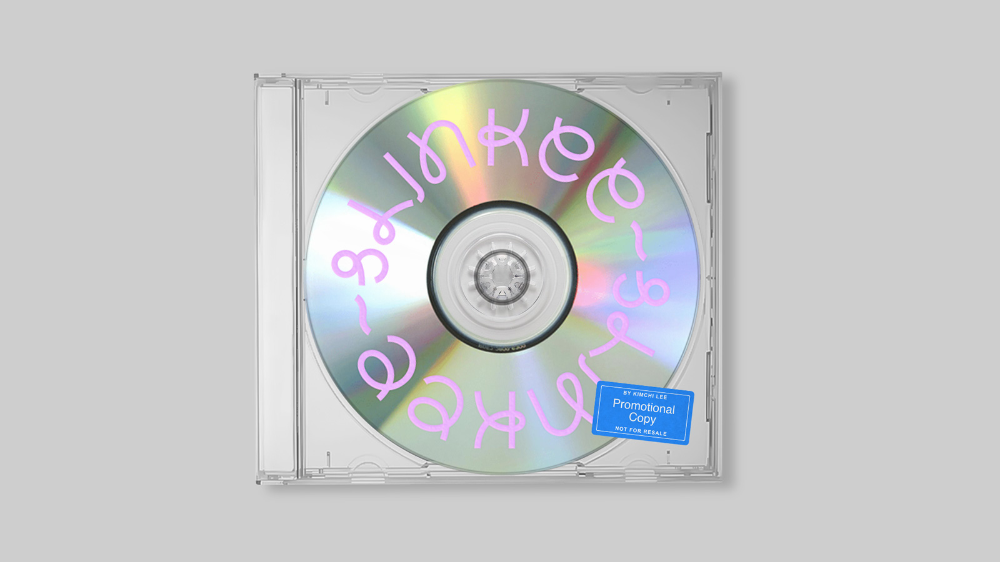
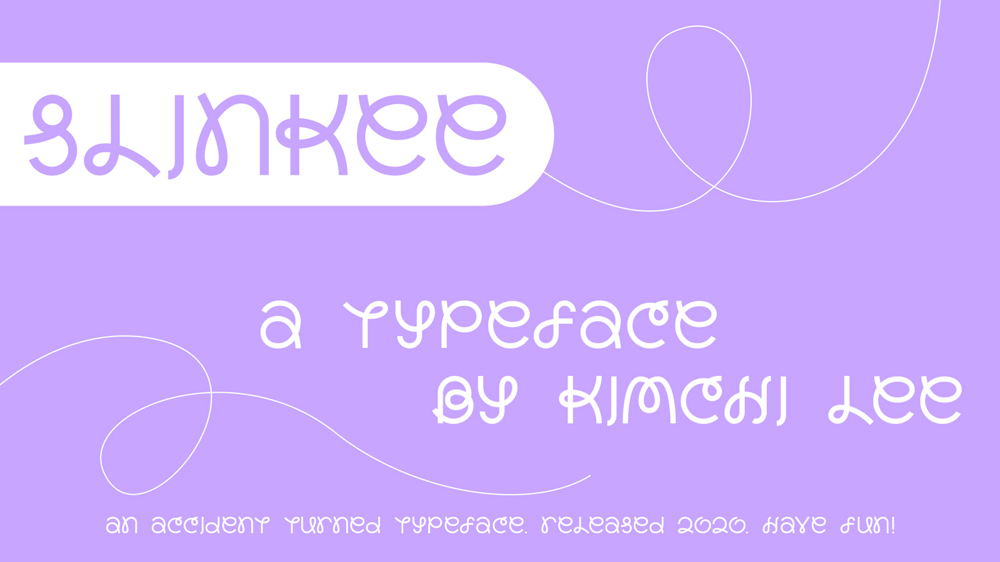
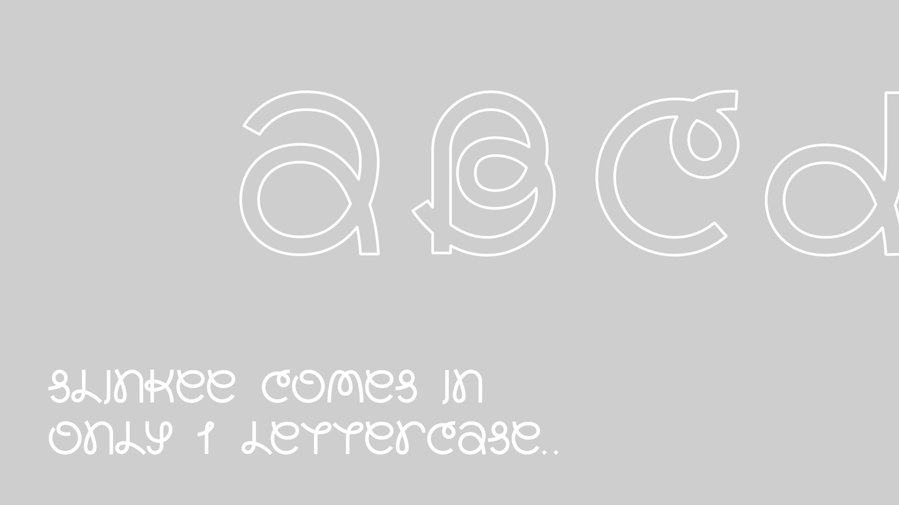
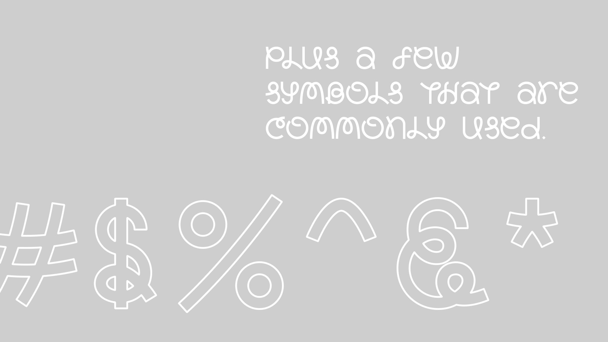
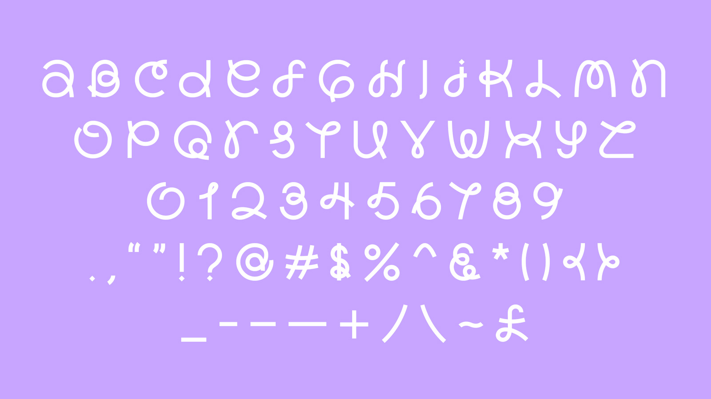
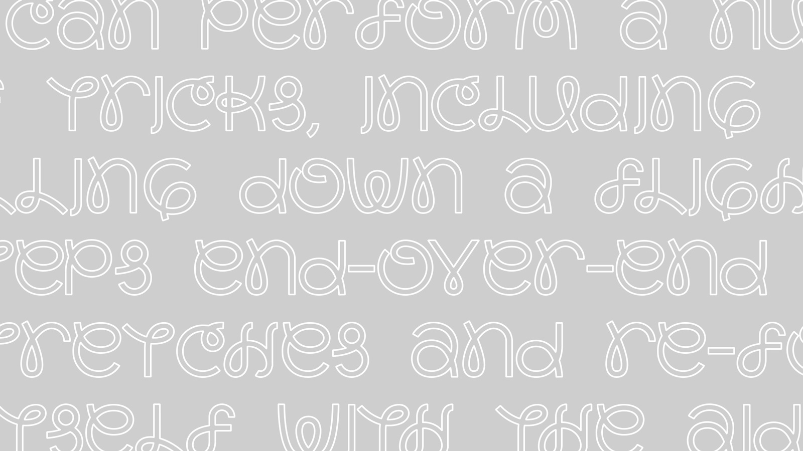
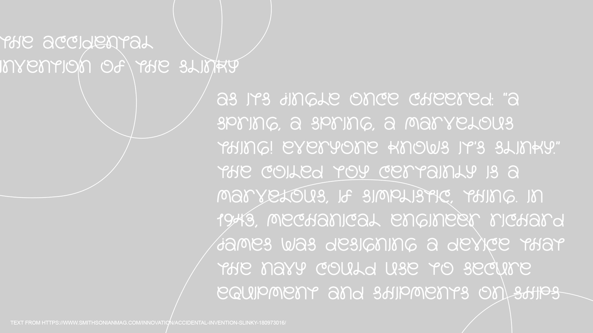
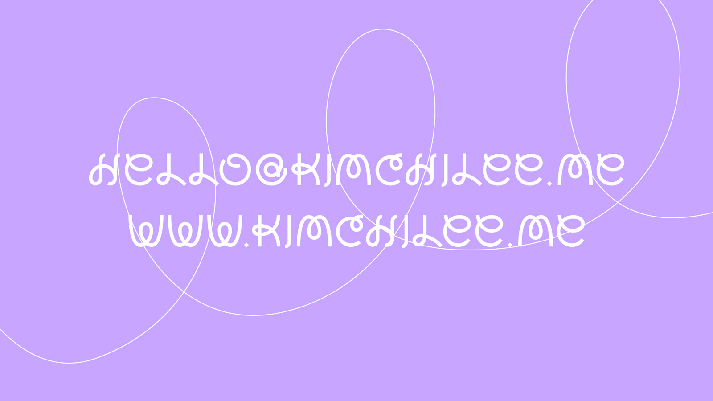

# Slinkee

Slinkee is a playful and bouncy typeface designed by [Kimchi Lee](http://kimchilee.me/) The typeface was made during an exploration of a completely different idea. Its design is meant to evoke the movement of the childhood favourite slinky toy, as it stretches out and closes back in. 

## Specimen

## License

Slinkee is licensed under the SIL Open Font License, Version 1.1.
This license is copied below, and is also available with a FAQ at
http://scripts.sil.org/OFL

## Repository Layout

This font repository structure is inspired by [Unified Font Repository v0.3](https://github.com/unified-font-repository/Unified-Font-Repository).
